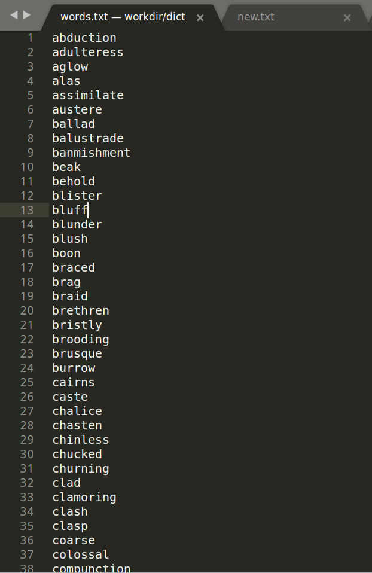
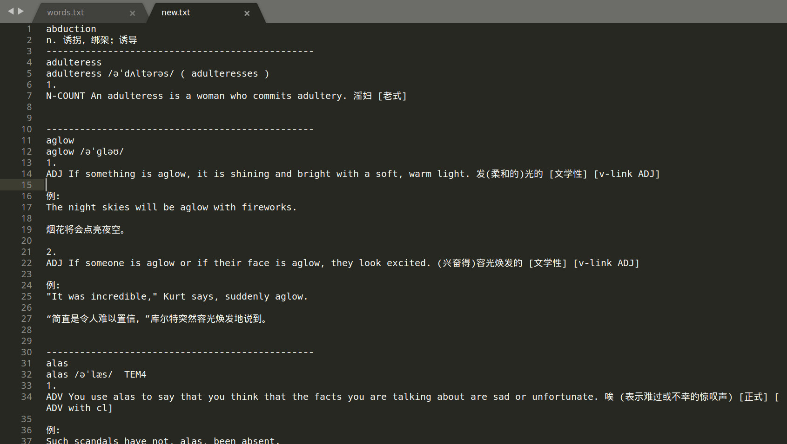

### 运行效果

#### 使用前

#### 使用后

### 本程序可以做什么
将成批的英语单词从词典中查出释义、音标、例句等内容

### 如何使用
在程序目录下创建 words.txt，内容为需要查询的英语单词，一行一个。
node index.js

查询结果将在 new.txt 中给出

### 注意事项
本程序使用无头浏览器在有道词典中查询，查询的内容为柯林斯词典内容。使用了最简单的实现方式（注意不是最好），实现方式效率较低，查询可能花费时间较长。

输出的 new.txt 中的换行符为 `\n` 而不是 `\r\n`。words.txt 中的换行符无所谓，程序会将其中的`\r`删掉。如果结果 new.txt 无法正常显示换行符，windows 用户请自行转换

本程序可能最近不会更新

### 为什么不直接用 get 请求做爬虫？

get 到的释义结果页面 html 中存在大量空白字符，处理较为麻烦。不如 innerText 来的快。
